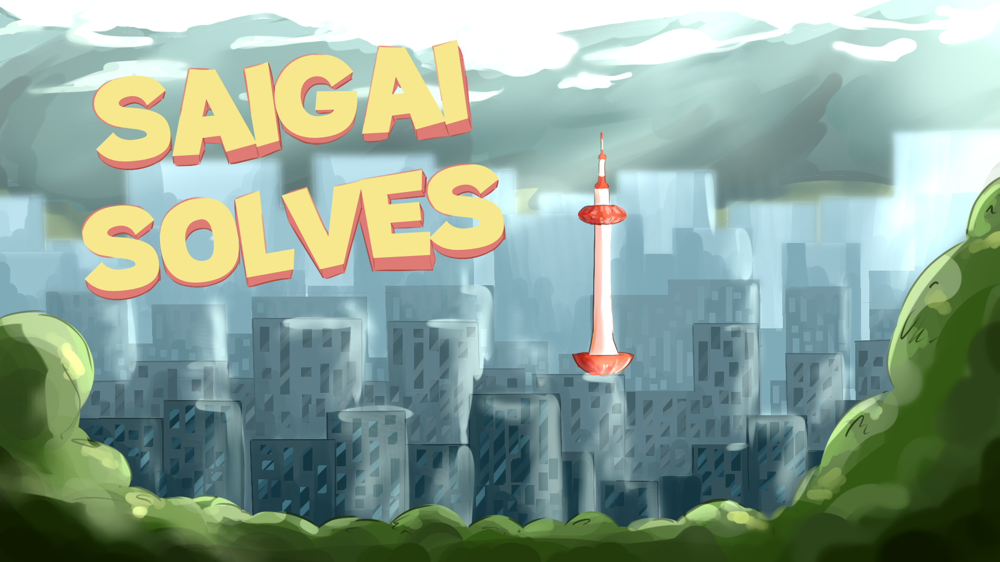

# _Saigai Solves!_ 

Saigai Solves is an exploration/puzzle game that focuses on educating players about natural disasters.



## Installing

Saigai Solves is available for macOS, Windows, Linux, and webGL. The game is triggered to be rebuilt after commit to the remote repository through GitHub Actions. Visit the [releases page](https://github.com/saigai-studios/saigai-solves/releases) to download and play the game for your preferred computer system.

## Building

To build the project from source, the following dependencies are required:
- [Unity Editor](https://unity.com/releases/editor/archive) (tested: 2022.3.30f1)
- [Python](https://www.python.org/downloads/) (tested: 3.8.6)
- [Just](https://github.com/casey/just/releases) (tested: 1.14.0)
- [Rust (with Cargo)](https://www.rust-lang.org/tools/install) (tested: 1.77.2)

All tools are assumed to be found on your path can be called with their native name. 

Run the following command for your preferred platform:
```
just build <unity> <target>
```
where:
- `<unity>` is the full path to the Unity Editor binary on your local file system  
Examples:
    - MacOS: `/Applications/Unity/Hub/Editor/<version>/Unity.app/Contents/MacOS/Unity`
    - Linux: `/Applications/Unity/Hub/Editor/<version>/Unity.app/Contents/Linux/Unity`
    - Windows: `C:\Program Files\Unity\Hub\Editor\<version>\Editor\Unity.exe`
- `<target>` is one of Unity's supported targets
Examples:
    - MacOS: `osxuniversal`
    - Linux: `linux64`
    - Windows: `win64`

### Windows Example
For example, to build on a Windows 64-bit computer with Unity installed to "C:\Program Files\Unity\Hub\Editor\2022.3.30f1\Editor\Unity.exe", run:
```
just build "C:\Program Files\Unity\Hub\Editor\2022.3.30f1\Editor\Unity.exe" "win64"
```

## Details

Saigai Solves's overarching goal is to educate players about natural disasters. This includes:

- How to prepare for a natural disaster (if possible)
- What to do when a natural disaster occurs
- How to recover from a natural disaster

To convey the information about natural disasters, Saigai Solves allows the user to traverse an overworld map and select one of multiple specially marked locations. Selecting a location will provide the user with a unique minigame tied to the location's context. Completing the minigame will reward the user with a _Saigai Card_, a cool collectible that provides informational tidbits about natural disasters and how to combat them.

Players can quickly recall natural disaster information from their collected Saigai Cards on the "gallery" screen, which is accessible from the game's start screen.

### Disasters 


Each world focuses on one particular disaster. Before entering a world, players have the ability to select which disaster to play through. The following is our roadmap for disasters support:

Disaster | Status |
--- | --- |
Earthquake | In-progress
Fire | Planned

## Contributing

Before working on the project for an extended period of time, be sure to do the following:

> __Note:__ All commands are ran from this README's directory in your local filesystem.

1. Pull the latest changes from the remote repository (either using `git` command-line tool or GitHub Desktop):
```
git pull
```

2. Rebuild the Rust dynamic library:
```
cd Rust; cargo run; cd ..
```

3. Open the project in Unity (either using `Unity` command-line tool or Unity Editor).
```
Unity -projectPath . 
```

## Adding text with language translation capabilities

Saigai Solves uses the Localization package from Unity to allow for translatable text throughout the game with the click of a button.
For this project (and probably general use), follow these steps as a template for your game objects:

__Note:__ This information will be updated as better organizaiton is demanded (creating new tables, etc.)

1. Window -> Asset Management -> Localization Tables. Create a new key and fill with corresponding information.

2. Select your text object and clear the "Text" field. Add a component "Localize String Event".

3. In "String Reference" select your key under the correct translation table. "Table Collection" should be the same table.

4. "Update String": Editor and Runtime; Text -> text; drag object from Hierarchy into dark gray field.

5. Hip Hip Hooray!!

## Team

Kelly Beaudrot, Joseph Benigno, Thet Ei, Gianna Giliberto, Thomas Le, Yi Min, Chase Ruskin  
